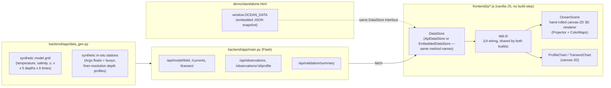

# Ocean 3D Visualization Platform — SIH26067 Prototype

A web-based interactive 3D platform that integrates **numerical ocean
model output** (temperature, salinity, currents on a lat/lon/depth/time
grid) with **in-situ observations** (Argo-float-style depth profiles and
moored buoys), for Smart India Hackathon 2026, problem statement **PS
26067** (Ministry of Earth Sciences / INCOIS — 3D visualization of ocean
data).

> **Honesty note:** the model grid and the observation profiles in this
> prototype are **synthetic** — generated with numpy to have the same
> shape and rough physical behaviour as real INCOIS/Copernicus Marine
> model output and real Argo float profiles, but they are not real
> measurements. See [Real data vs. synthetic data](#real-data-vs-synthetic-data)
> for exactly what would need to change to point this at real sources, and
> [Limitations](#limitations) for what else is out of scope for a hackathon
> prototype.

## What it does

- Renders an ocean-surface mesh (a region of the Arabian Sea / Bay of
  Bengal / equatorial Indian Ocean) in a hand-rolled 3D scene, coloured by
  temperature or salinity, with height relief driven by the same field.
- Overlays ocean current vectors and ~18 Argo-float/buoy station markers.
- Depth and time sliders (5 depth levels, 6 daily steps) with a play/pause
  animation, and smooth transitions between slices instead of jump-cuts.
- Click a station (in the 3D view, by hovering, or from the searchable
  list in the sidebar) to compare its **observed** depth profile against
  the **model's** profile at the nearest grid column — the actual
  "integration" story the problem statement is asking for.
- A **model-skill panel** aggregating RMSE/bias between every station and
  the model, at the depths they share — quantifying how well the model
  matches reality, not just plotting both.
- A **vertical cross-section (transect)** view: a depth-vs-longitude
  Hovmöller-style slice at a chosen latitude, showing genuine vertical
  structure (not just a horizontal slice at a time).
- CSV export of any station's observed + model profile.
- Works two ways from the *same* rendering code (see
  [Architecture](#architecture)): a full Flask API + frontend, or a
  single self-contained HTML file with the data embedded (no server).

## Quick start

```bash
cd backend
pip install -r requirements.txt   # flask, numpy
python -m app.main                # or: ./run.sh
```

Open http://localhost:8000/ — the Flask app serves both the API and the
frontend.

For the no-install, no-server version, just open `demo/standalone.html` in
any browser (also regeneratable with `python3 build_demo.py`).

## Architecture



The same `frontend/js/app.js` drives two builds:

- **Live app** (`frontend/index.html`): `ApiDataStore` fetches from the
  Flask API in `backend/`.
- **Standalone demo** (`demo/standalone.html`, produced by
  `build_demo.py`): `EmbeddedDataStore` reads a JSON snapshot embedded
  directly in the page — no server, works from a `file://` URL.

`app.js` picks whichever store is available (`window.OCEAN_DATA` present
→ embedded; otherwise the API) — the rendering and UI code never knows or
cares which one it's talking to.

There is deliberately **no WebGL / Three.js / npm build step**: the 3D
scene (`frontend/js/scene.js` + `projector.js`) is a small hand-rolled
perspective-projection + painter's-algorithm renderer on a plain
`<canvas>` 2D context. That keeps the whole platform dependency-free —
no CDN to go down mid-demo, no version pinning, works fully offline — at
the cost of being software-rendered rather than GPU-accelerated. For a
production system, swapping `scene.js` for a Three.js/deck.gl/CesiumJS
renderer behind the same `OceanScene` method names (`setField`,
`setCurrents`, `setStations`, `render`) is the natural next step and
would not require touching `app.js` or the data layer at all.

### File map

```
backend/
  app/data_gen.py      synthetic dataset — the ONLY file a real-data
                        integration needs to replace (see below)
  app/main.py           Flask routes
  requirements.txt
frontend/
  index.html, style.css
  js/colormap.js         sequential colour scales (pure, unit-tested)
  js/projector.js         3D camera/projection math (pure, unit-tested)
  js/scene.js             OceanScene: canvas rendering + interaction
  js/profile-chart.js      depth-profile line chart (obs vs. model)
  js/transect-chart.js     vertical cross-section heatmap
  js/datastore-api.js      DataStore backed by the Flask API
  js/datastore-embedded.js DataStore backed by embedded JSON
  js/app.js                wires a DataStore + OceanScene + UI controls
demo/
  standalone.html         generated — full no-server demo
  artifact_fragment.html  generated — same content, no doctype/html/body
                          wrapper (for embedding in a host page)
build_demo.py            generates demo/ from data_gen.py + frontend/js/*
tests/
  test_pure_modules.js    Node unit tests for colormap.js / projector.js
  playwright_smoke.js     headless browser smoke test (loads the app,
                          checks for console/page errors, screenshots it)
```

## Real data vs. synthetic data

Every number a judge would ask "is that real?" about comes from
`backend/app/data_gen.py`, and only that file. The intended integration
points, if this were taken past a hackathon prototype:

| Synthetic today | Real source | Swap-in point |
|---|---|---|
| `get_model_dataset()` — numpy-generated temperature/salinity/currents grid | INCOIS GOFS / HYCOM forecast, or Copernicus Marine reanalysis (NetCDF, served via OPeNDAP/ERDDAP or a downloaded file) | Replace with an `xarray.open_dataset(...)` call subsetted to the region/time/depths, keeping the same return shape `(time, depth, lat, lon)` |
| `get_observations()` — synthetic Argo/buoy profiles | Argo GDAC (ftp.ifremer.fr or usgodae.org) NetCDF profile files, or INCOIS's own buoy network (RAMA/OMNI) | Replace with a loader that reads each float's latest profile file and maps it to the same station dict shape (`id`, `lon`, `lat`, `depths`, `temperature`, `salinity`) |
| `get_model_column()` / `get_transect()` | same real model source, just indexed differently | No change needed — these already just index into whatever `get_model_dataset()` returns |

Nothing in `main.py`, `app.js`, `scene.js`, or the chart modules needs to
change for this swap — they only ever call the functions above, never
touch numpy directly.

## Limitations

Scoped out deliberately for a hackathon prototype, not because they're
hard to state — flagging them is the point:

- **No real data**: see above. No credentialed API access or large NetCDF
  downloads were available in the environment this was built in.
- **No authentication, persistence, or multi-user state** — this is a
  single-session visualization tool, not a deployed service.
- **Software-rendered 3D** (see Architecture) — fine for a hackathon demo
  on a laptop, not a substitute for a GPU-accelerated renderer at
  production scale/resolution.
- **Region and resolution are fixed** (21×21 grid, 5 depths, 6 time
  steps) — enough to demonstrate the interaction model, not a
  full-resolution operational grid.
- **The Flask dev server** (`app.run(...)`) is explicitly not
  production-grade — swap for gunicorn/uwsgi behind a real web server
  before deploying anywhere persistent.

## Testing

```bash
node tests/test_pure_modules.js     # colormap + projector math, no browser needed
node tests/playwright_smoke.js      # full headless browser check (needs Playwright + Chromium)
```

The Playwright smoke test loads the running app, checks for console/page
errors and failed HTTP requests, confirms the canvas actually has
rendered content (not a blank page), exercises the station-click and
screenshots the result.
